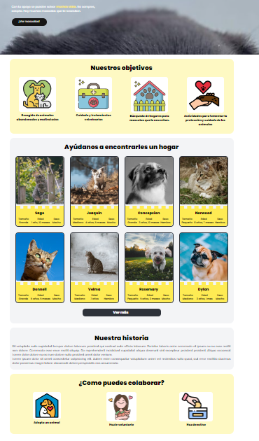

# Información del proyecto
Desarrollado con el stack TALL
- [TailwindCSS](https://tailwindcss.com/)
- [AlpineJS](https://alpinejs.dev/)
- [Laravel](https://laravel.com/)
- [Livewire](https://laravel-livewire.com/)


- [FilamentPHP](https://filamentphp.com/)


---


# Instrucciones
Para ejecutar el proyecto hay que copiar el archivo .env.example a .env
```bash
cp .env.example .env
```

Iniciar docker con sail
```bash
./vendor/bin/sail up -d
```

Si nos hemos descargado el proyecto en otro ordenador y estamos en linux:
```bash
docker run --rm \
    -u "$(id -u):$(id -g)" \
    -v $(pwd):/var/www/html \
    -w /var/www/html \
    laravelsail/php81-composer:latest \
    composer install --ignore-platform-reqs
```

Ejecutar el comando para crear el enlace simbólico para que storage pueda funcionar:
```bash
php artisan storage:link
```

Y dentro de Sail ejecutar:
```bash
composer install
npm install
npm run dev
```

Ejecutar las migraciones:
>php artisan migrate:fresh --seed

Usuario y contraseña de prueba:

>Usuario: admin@admin.com

>contraseña: password

Navegar a: 
>http://localhost/

# Sprint 1.0 
# Sprint 2.0 
# Sprint 3.0 

Primera parte del proyecto de fin de curso. 
- [Diagrama de casos de uso](#casos_de_uso)
- [Diagrama de bases de datos](#bases_de_datos)
- [Wireframes](#wireframes)
- [Vistas](#vistas)
- [Rutas](#rutas)


<a name="casos_de_uso"></a>
## Diagrama de casos de uso


<a name="bases_de_datos"></a>
## Diagrama de bases de datos


<a name="wireframes"></a>
## Diagrama de casos de uso


<a name="vistas"></a>
## Vistas de la aplicación




## Vistas del administrador


<a name="rutas"></a>
## Listado de rutas.

>php artisan route:list


## Desarrollo
Para inicializar el proyecto en entorno dev y arrancar Vite para escuchar cambios:
>npm run dev

## Producción
Para compilar todos los archivos a través de Vite:
>npm run build

---


# Información sobre las dependencias utilizadas

## Instalación de Sass
>npm install sass --save-dev

## Instalación de Tailwind sobre laravel.
>npm install -D tailwindcss postcss autoprefixer
>npx tailwindcss init -p

```js
/** @type {import('tailwindcss').Config} */
module.exports = {
  content: [
    "./resources/**/*.blade.php",
    "./resources/**/*.js",
  ],
  theme: {
    extend: {},
  },
  plugins: [],
}
```
```css
@tailwind base;
@tailwind components;
@tailwind utilities;
```

## Instalación AlpineJS
https://alpinejs.dev/
>npm install alpinejs

```js
import Alpine from 'alpinejs'
 
window.Alpine = Alpine
 
Alpine.start()
```

## Instalación de Livewire
>composer require livewire/livewire

Incluir los assets de livewire:
```php
  <html>
  <head>
      ...
      @livewireStyles
  </head>
  <body>
      ...
      @livewireScripts
  </body>
  </html>
```

<hr>

<p align="center"><a href="https://laravel.com" target="_blank"></a></p>

<p align="center">
<a href="https://github.com/laravel/framework/actions"></a>
<a href="https://packagist.org/packages/laravel/framework"></a>
<a href="https://packagist.org/packages/laravel/framework"></a>
<a href="https://packagist.org/packages/laravel/framework"></a>
</p>